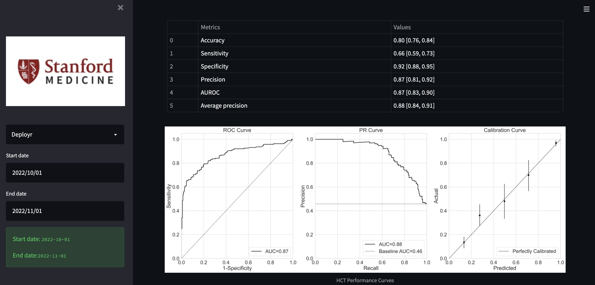

# Deployr Dashboard

After that, you can follow the steps below. 

# Table of Contents
- [Virtual Environment](#virtual-environment)
- [Docker Desktop](#docker-desktop)

# Virtual Environment

Next, we will run the code virtually, 

Step 1: Create a virtual environment

```bash
python -m venv <env_path>
source <env_path>/bin/activate
pip install -r requirements.txt
```

This will create the virtual environment, activate it, and install all the dependencies.

Now, set the two environment variable as such in your terminal. 

```bash
export COSMOS_HOST=<COSMOS_HOST>
export COSMOS_READ_KEY=<COSMOS_READ_KEY>
export COSMOS_DB_ID=<COSMOS_DB_ID>
```

Step 2: Run the main.py file

```bash
streamlit run main.py
```

# Docker Desktop

Now, let us run the code in docker. First, you will need to install docker desktop: [Mac](https://docs.docker.com/desktop/install/mac-install/), [Windows](https://docs.docker.com/desktop/install/windows-install/). Make sure to select the right software for your device. 

Next, open the docker desktop and keep it running while you are working with following code:

```bash
docker image build -t <image_name> . 

docker run \
-p 8080:8080 \
-e COSMOS_HOST=<COSMOS_HOST> \
-e COSMOS_READ_KEY=<COSMOS_READ_KEY> \
-e COSMOS_DB_ID=<COSMOS_DB_ID> \
<image_name>
```

This will build the docker and run the docker. You can check Dockerfile to see exactly what is happening inside. 

This is what the site should look like:


